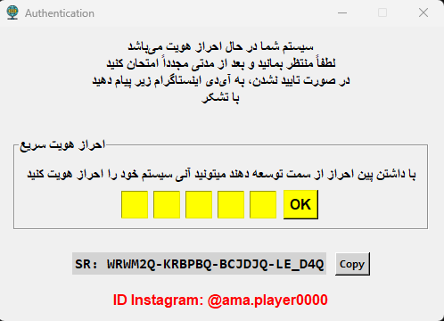
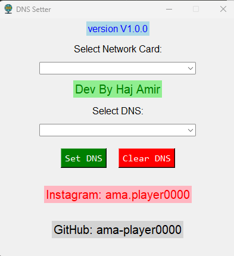

# 🌐 DNS Changer – Windows DNS Manager

## 🖼️ Preview Page Autentication

  

<h2> 🔐 Pin Code Fast Authentication: X6985</h2>

## 🖼️ Preview SoftWare

  

## 📌 Introduction
DNS Changer is a useful tool for Windows that provides easy DNS management for users. This software is built with a simple graphical interface and uses official Windows commands and can be used without the need for installation, with just an EXE file.

Currently **the EXE version is in the repository** and **the source code version (Open Source)** has not been publicly released.

## ⭐ Features
- ✔️ Display list of active network cards 
- ✔️ Select and set DNS with one click 
- ✔️ Support for popular DNS: 
- RadarDNS 
- ElectroDNS 
- Cloudflare 
- Google 
- Shecan 
- Begzar 
- OpenDNS 
- Quad9 
- ✔️ Ability to enter custom DNS (Custom DNS) 
- ✔️ Dedicated button to restore DNS to **DHCP** 
- ✔️ Simple, fast and lightweight user interface 
- ✔️ Standalone executable file without the need for Python

---

## 🔧 Technologies
- **Python 3** 
- **Tkinter** for UI 

---

## 🔐 Required Permission Level
To apply the new DNS, the program needs **Run as Administrator**. 
Without admin access, Windows will not allow DNS changes.

## 📥 Installation and Run
No installation or configuration required.
1. Download the `DNSChanger.exe` file 
2. Right-click on it 
3. Click **Run as Administrator** 
4. Use the program

---

## 📄 Source code status
The program source is **currently not released** and only the EXE version can be downloaded. 
An Open Source version may also be added in the future.

## Developer 👨‍💻 

Developed by Haj Amir

Instagram <a href="instagram.com/ama.player0000">@ama.player0000</a>

